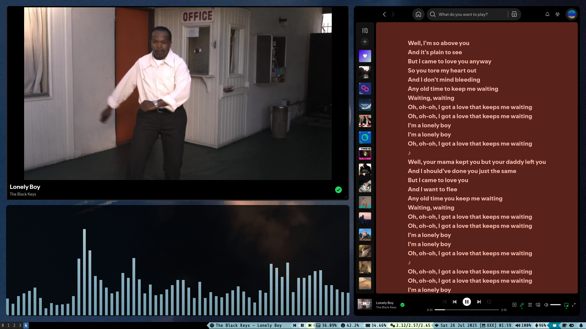

#

<h1 align="center">Jamer José</h1>

&ensp;ABOUT

<h4 align="center">
Backend Developer |
Data Engineer at IPG Mediabrands |

</h4>

&ensp;STACK

- **Lenguajes**

    
    
    

- **Backend**

    
    
    
    

- **Frontend**

    
    
    
    

- **Entorno**

    
    
    
    

&ensp;DESKTOP

</img>
    

        

            &ensp;
        

        </img>
    

    

    &ensp;CONTACT & SOCIAL
    

    

        <samp>
            

             
            <!-- LinkedIn -->
            
            <!-- Gmail -->
            
             
            

        </samp>
    

