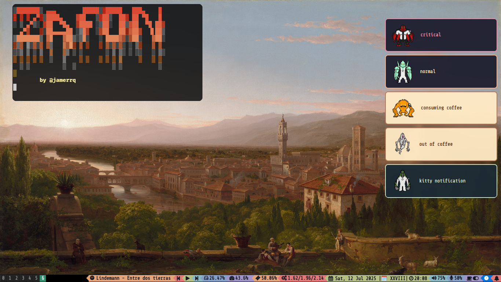
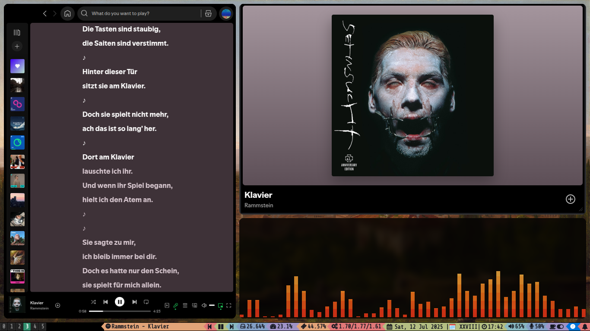

#

<h1 align="center">Jamer José</h1>

&ensp;ABOUT

<h4 align="center">
Backend Developer |
Data Engineer at IPG Mediabrands (MEX) |

</h4>

&ensp;SKILLS

- **Lenguajes**:
    
    
    

- **Backend**:
    
    
    
    
    

- **Frontend**:
    
    
    
    
    

- **Data Engineering**:
    
    
    
    
    

- **Testing**:
    
    
    
    

- **Cloud & DevOps**:
    
    
    
    

- **Herramientas**:
    
    
    
    

     
    

        &ensp;GIT STATS
    

    

        

            
        

        

            
        

        

            
        

    

&ensp;DESKTOP

</img>
    

        

            &ensp;
        

        </img>
    

    

    &ensp;CONTACT & SOCIAL
    

    <samp>
        

         
        <!-- LinkedIn -->
        
        <!-- Gmail -->
        
        <!-- Whatsapp -->
        
         
         
        <!-- Discord -->
        
        <!-- Twitter -->
        
        

    </samp>

## Recent Activity

<!--RECENT_ACTIVITY:last_update-->
Last Updated: Sunday, July 20th, 2025, 2:01:24 AM (GMT)
<!--RECENT_ACTIVITY:last_update_end-->
<!--RECENT_ACTIVITY:start-->
1. ⭐ Starred [cmang/durdraw](https://github.com/cmang/durdraw) 
2. ⬆️ Pushed 1 commit(s) to [jamerrq/jamerrq.dev](https://github.com/jamerrq/jamerrq.dev) 
3. ⬆️ Pushed 1 commit(s) to [jamerrq/jamerrq](https://github.com/jamerrq/jamerrq) 
4. ⬆️ Pushed 1 commit(s) to [jamerrq/zafon](https://github.com/jamerrq/zafon) 
5. ⭐ Starred [betterlockscreen/betterlockscreen](https://github.com/betterlockscreen/betterlockscreen) 
<!--RECENT_ACTIVITY:end-->
