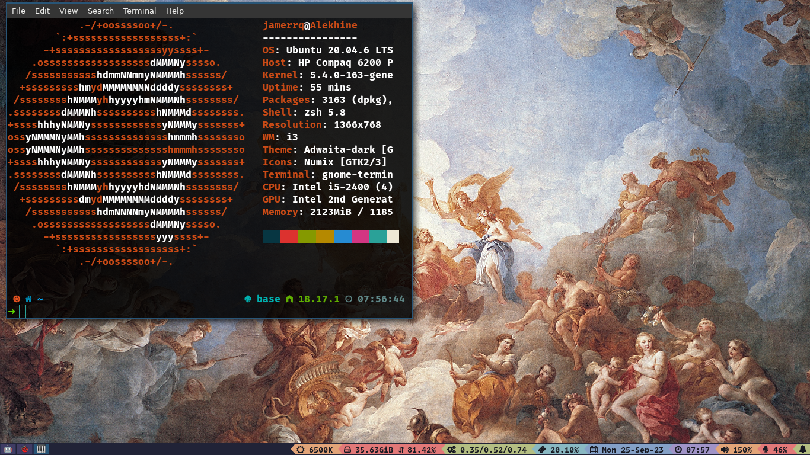
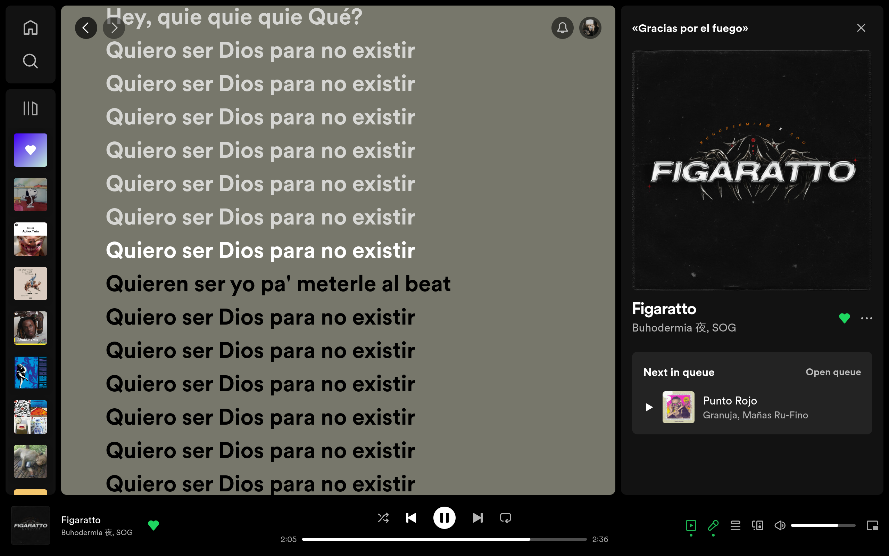

#

<h1 align="center">Jamer José</h1>

&ensp;ABOUT

<h4 align="center">Full Stack Web Developer | <a href="https://jamerrq-com.vercel.app/" target="_blank">
Personal Webpage</a> | <a href="https://my-portfolio-jamerrq.netlify.app/assets/pdf/CV_JamerRebolledo.pdf" target="_blank">Curriculum Vitae</a></h4>

&ensp;SKILLS

- **Languages**:

    
    
    

- **Full Stack Development**:

   
   
   

   
   

   
    

   
   

   
   
   

- **Learning**:

    

&ensp;MORE SKILLS

- **Testing**

    
    
    
    

- **Cloud Hosting**:

    
    
    

    
    

- **Softwares and Tools**:

    
    
    

    
    
    

    
    

- **Extras**:

    
    
    

     
    

        &ensp;GIT STATS
    

    

        

            
        

        

            
        

        

            
        

    

&ensp;DESKTOP

</img>
&ensp;
</img>

-----

    

    &ensp;CONTACT ME
    

    <samp>
        

         
        
        
        
        <!-- Discord -->
        
        
        

        <!-- Webpage -->
        

        
        

    </samp>

-----

    
    </img>

